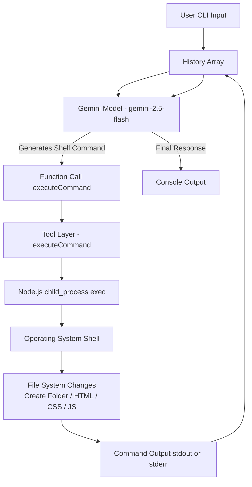

### Architecture Pattern

This project implements an autonomous AI agent capable of:
- Interpreting user requirements
- Generating OS-specific shell commands
- Executing commands via Node.js
- Observing system output
- Iteratively building a website step-by-step

Pattern Used:
Reason → Act → Observe → Refine

## 🏗️ High-Level Architecture Diagram

